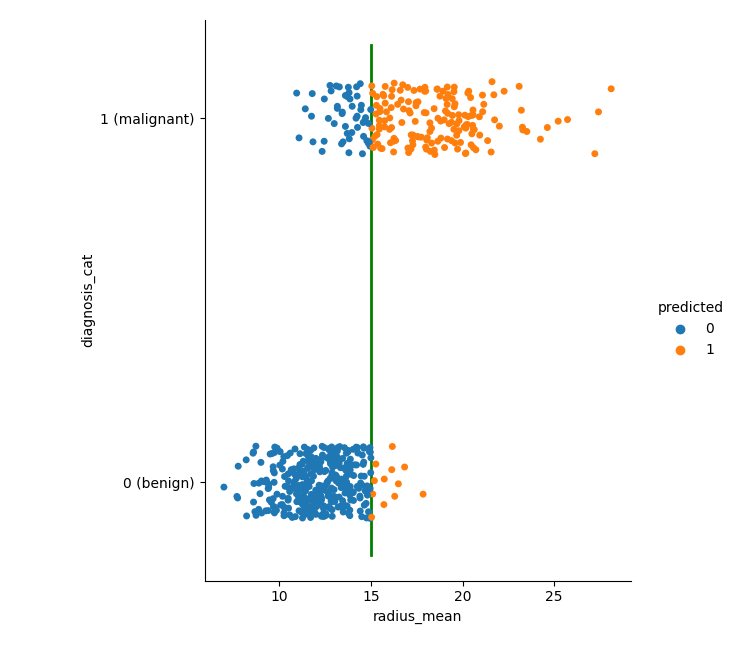

## Logistic Regression:

Following command runs 2D logistic regression models on the given *.csv data file. TO DO: and 3D logistic regression
```
$ python LogisticRegression.py
```
<!--  -->
Shows how tissue samples in cancer.csv are classified using logistic regression using "radius" of the cells


W. N. Street, W. H. Woilberg, O. L. Mangasarian, "[Nuclear Feature Extraction For Breast Tumor Diagnosis](https://www.researchgate.net/profile/Nick-Street/publication/2512520_Nuclear_Feature_Extraction_For_Breast_Tumor_Diagnosis/links/549f789b0cf267bdb8fdbe0e/Nuclear-Feature-Extraction-For-Breast-Tumor-Diagnosis.pdf)", SPIE 1993
