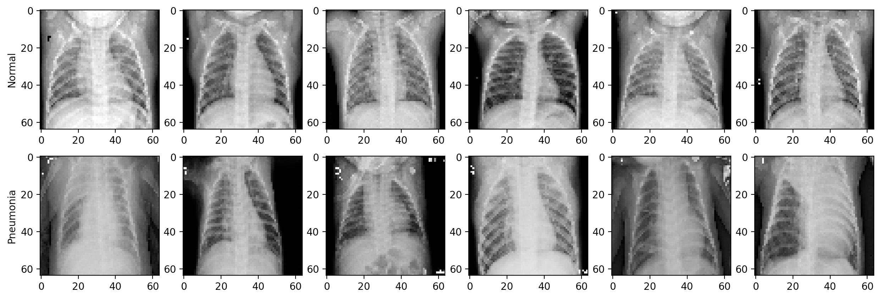
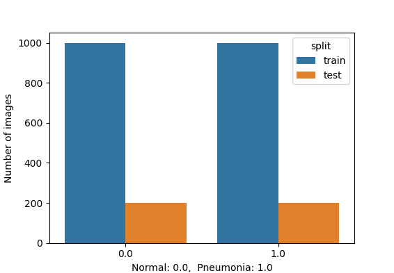
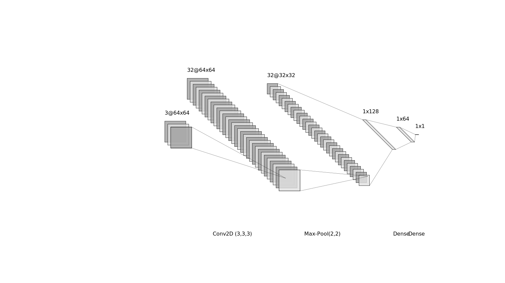

## Pneumonia Detection:


Detects pneumonia from X-ray images. Use the following commandline to run:
```
$ python PneumoniaDetection.py --training    // for training
$ python PneumoniaDetection.py               // for inference
```

## Results:
Illustration of Normal vs. Pneumonia X-rays. Untrained eye can not distinguish pneumonia from images. Training & testing dataset is composed of 1200 normal + 1200 pneumonia images .

Sample X-rays              |  Train & Test Dataset
:-------------------------:|:-------------------------:
   |  

Tested four classification algortihms as Baseline with accuracies as listed below. MLP has the highest accuracy of ~75%:
```
Running KNeighbors ...
Running LogisticRegression ...
Running DecisionTree ...
Running MLP ...
   CNN (3-layer)      KNeighbors      LogisticRegression     DecisionTree      MLP (Perceptron)  
      0.88750             0.7025              0.6775              0.6575              0.7575      
```

Diagram for one hdden layer CNN with two fully connected layers is shown below


The total model parameters are:
```
_________________________________________________________________
 Layer (type)                   Output Shape              Param #   
=================================================================
 conv2d (Conv2D)                (None, 64, 64, 32)        896              
 activation (Activation)        (None, 64, 64, 32)        0              
 max_pooling2d (MaxPooling2D)   (None, 32, 32, 32)        0           
 conv2d_1 (Conv2D)              (None, 32, 32, 64)        18496        
 activation_1 (Activation)      (None, 32, 32, 64)        0           
 max_pooling2d_1 (MaxPooling2D  (None, 16, 16, 64)        0         
 conv2d_2 (Conv2D)              (None, 16, 16, 64)        36928     
 activation_2 (Activation)      (None, 16, 16, 64)        0         
 max_pooling2d_2 (MaxPooling2D) (None, 8, 8, 64)          0         
 flatten (Flatten)              (None, 4096)              0         
 dense_4 (Dense)                (None, 128)               524416    
 dropout (Dropout)              (None, 128)               0         
 dense_5 (Dense)                (None, 64)                8256      
 dropout_1 (Dropout)            (None, 64)                0
 dense_6 (Dense)                (None, 1)                65                                                                
=================================================================
Total params: 589057 (2.25 MB)
Trainable params: 589057 (2.25 MB)
Non-trainable params: 0 (0.00 Byte)
```

## Related Work:
1. Paul Mooney, Detecting Pneumonia in X-Ray Images https://www.kaggle.com/code/paultimothymooney/detecting-pneumonia-in-x-ray-images/input
2. D. S. Kermany, M. Goldbaum, W. Cai, M. A. Lewis, K. Zhang
Huimin Xia, "[Identifying Medical Diagnoses and Treatable Diseases by Image-Based Deep Learning](https://www.cell.com/cell/fulltext/S0092-8674(18)30154-5)", Cell, Feb 2018

## Reference:
"[Classifier comparison"] (https://scikit-learn.org/stable/auto_examples/classification/plot_classifier_comparison.html)

